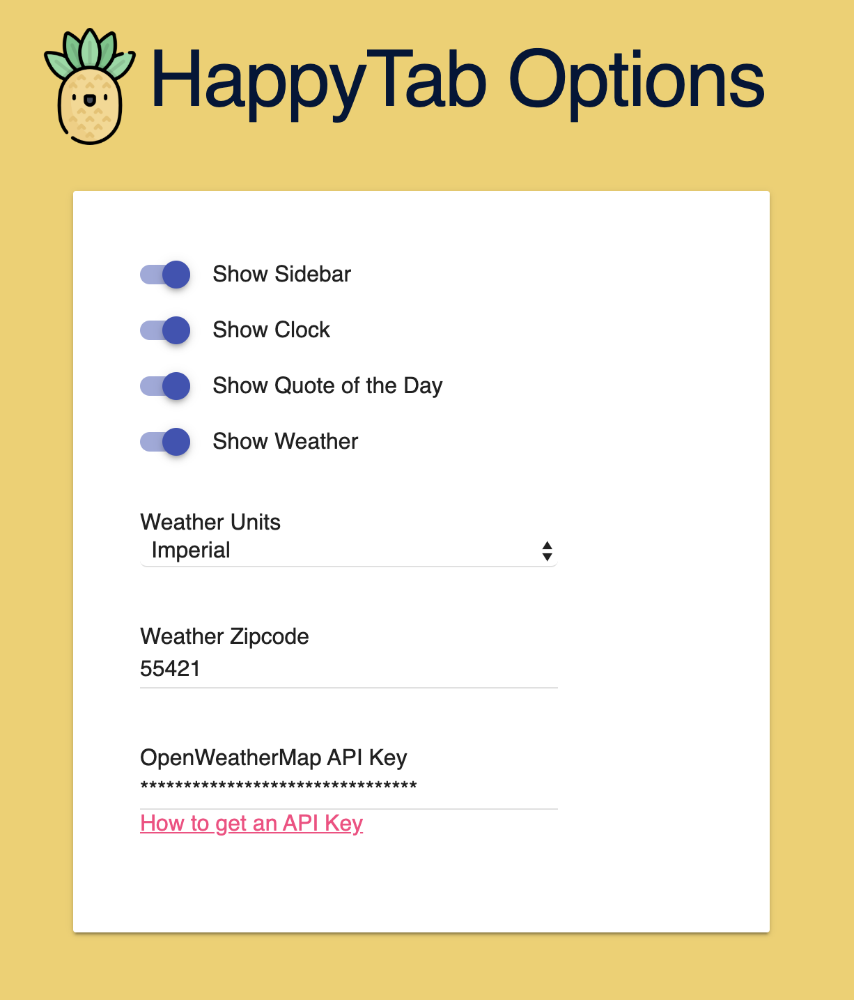

# HappyTab

  

 

HappyTab is a Chrome browser extension that displays the time and date, weather, quotes and all of your bookmarks in a single, beautiful webpage

## Getting Started

Getting started is easy! Simply follow the steps below

### Prerequisites

You need Chrome installed on your computer

### Installing

* Clone the repo
* Open the Chrome Extensions page chrome://extensions/
* Enable Developer Mode (top right corner)
* Click Load Unpacked (top left corner)
* Navigate to the repository root directory in your file system
* Confirm your selection
* Open a new tab!

You should see the following:

### Configuration

A number of settings can be configured in the Options page:

## Built With

Good ol' fashioned JavaScript

## Contributing

Please read [CONTRIBUTING.md](./CONTRIBUTING.md) for details on our code of conduct, and the process for submitting pull requests to us.

## Authors

* **Mike Dupuis** - *Initial work* - [mikedupuis](https://github.com/mikedupuis)

See also the list of [contributors](./CONTRIBUTORS.md) who participated in this project.

## License

This project is licensed under the MIT License - see the [LICENSE.md](./LICENSE) file for details

## Acknowledgments

* Hat tip to anyone whose code was used
